# .NET-Backend-Developer-Roadmap
.NET-Backend-Developer-Roadmap for 2024

這是個人針對.NET backend 開發人員的 roadmap，今年LLM整合應用我滿看好。
[PDF下載](./NETbackendRoadmap2024.pdf)

## 💯Rico技術學院線上課程
[完整線上課程清單](https://ricochen-s-school.teachable.com/p/myudemy)
|   |   |   |
| - | - | - |
| [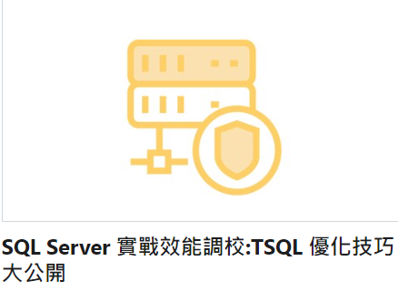](https://www.udemy.com/course/sql-server-tsql/?referralCode=E7B391784D9E411C5386) |  | [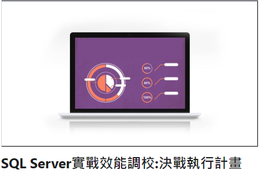](https://www.udemy.com/course/sql-server-execution-plan/?referralCode=22F0F9971E9BBBF55E75) |
| [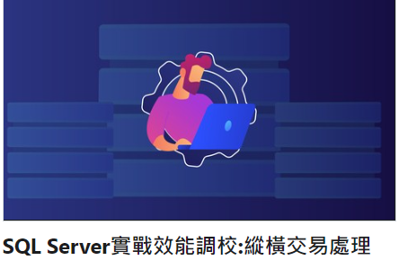](https://www.udemy.com/course/sql-server-transaction/?referralCode=01D1725846DCDD5E1918) | [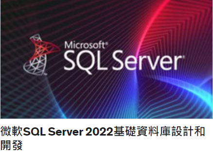](https://www.udemy.com/course/sql-server-v2022/?referralCode=38F5258D927FE8D1F33C) | 
| - | - | - |
[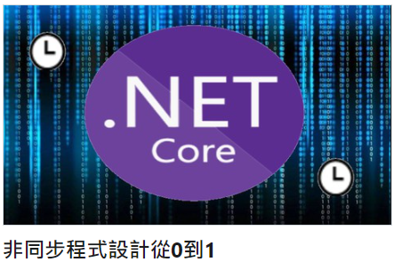](https://www.udemy.com/course/01-async/?referralCode=FF456E58A7A172F8DAE7) | [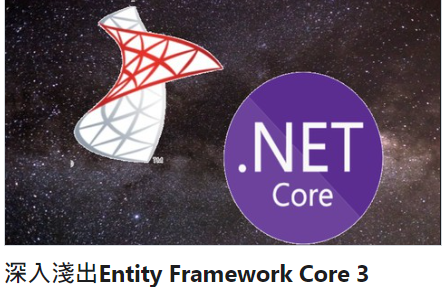](https://www.udemy.com/course/entity-framework-core-3/?referralCode=5EBEE5727A8428F9C7DF) | [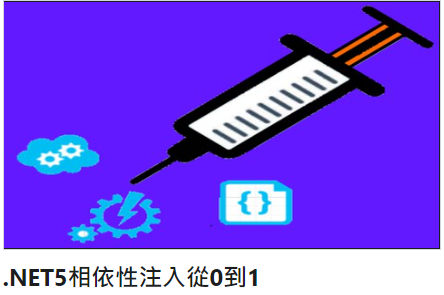](https://www.udemy.com/course/net501-w/?referralCode=32CCE8E89DB53EB3CBCC) | 
[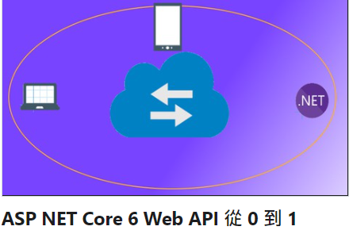](https://www.udemy.com/course/asp-net-core-6-web-api-0-1/?referralCode=8C6E4C674A8C55828949) | [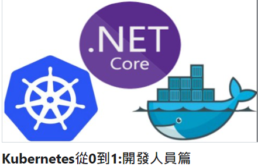](https://www.udemy.com/course/kubernetes01/?referralCode=74718318DC045AB60193) 
| - | - | - |
[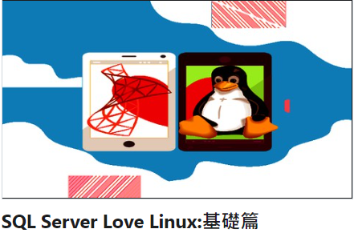](https://www.udemy.com/course/draft/3502206/?referralCode=E34B2B1CEF9A79664BE8) | [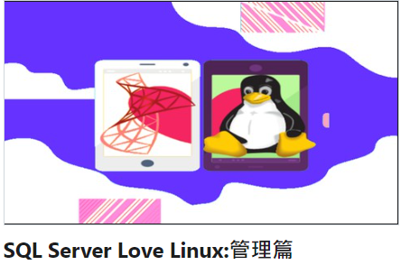](https://www.udemy.com/course/draft/3502290/?referralCode=29B9E988B89E15724693) | [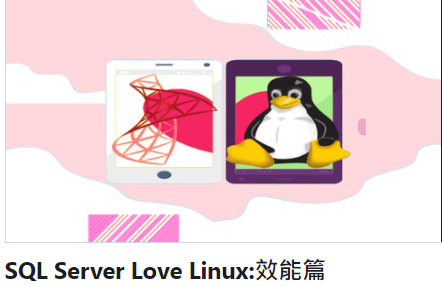](https://www.udemy.com/course/sql-server-love-linux-performance/?referralCode=E0D0F04F986B33790460)

## 💯Rico技術學院電子書
[完整電子書清單](https://ricochen-s-school.teachable.com/p/sqlserverbook)
|   |   |   |
| - | - | - |
[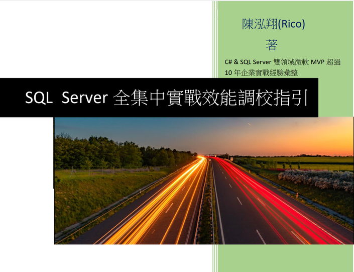](https://ricochen-s-school.teachable.com/p/sql-server-ebook) | [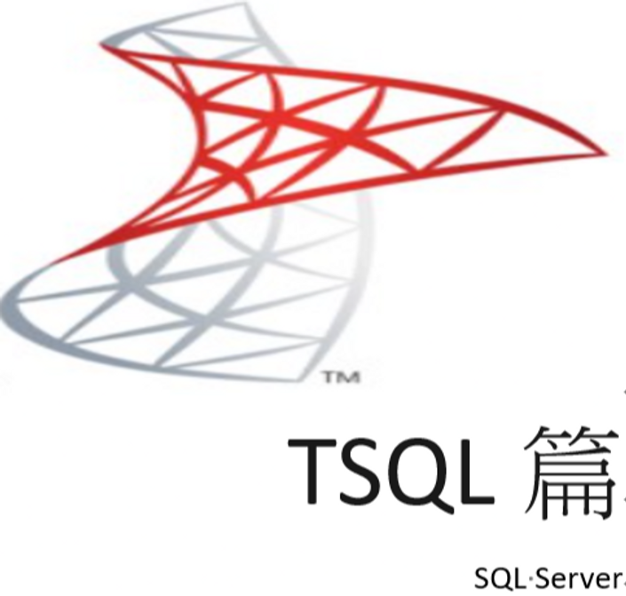](https://ricochen-s-school.teachable.com/p/sql-server-ebook2) | [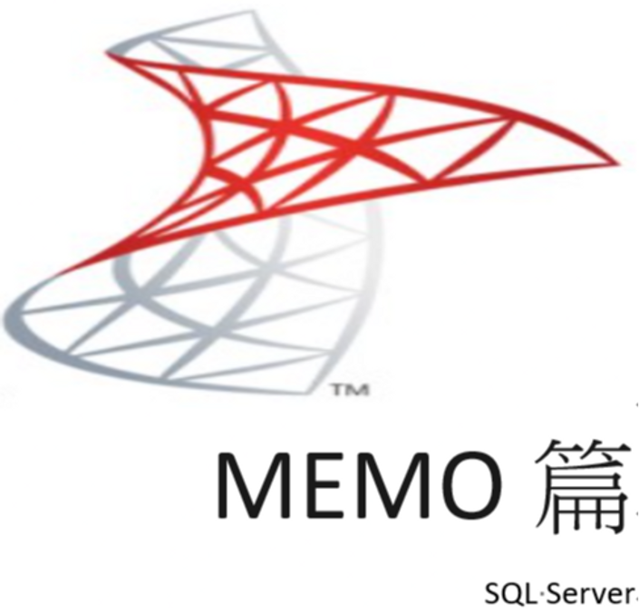](https://ricochen-s-school.teachable.com/p/sql-server-ebook3) |
[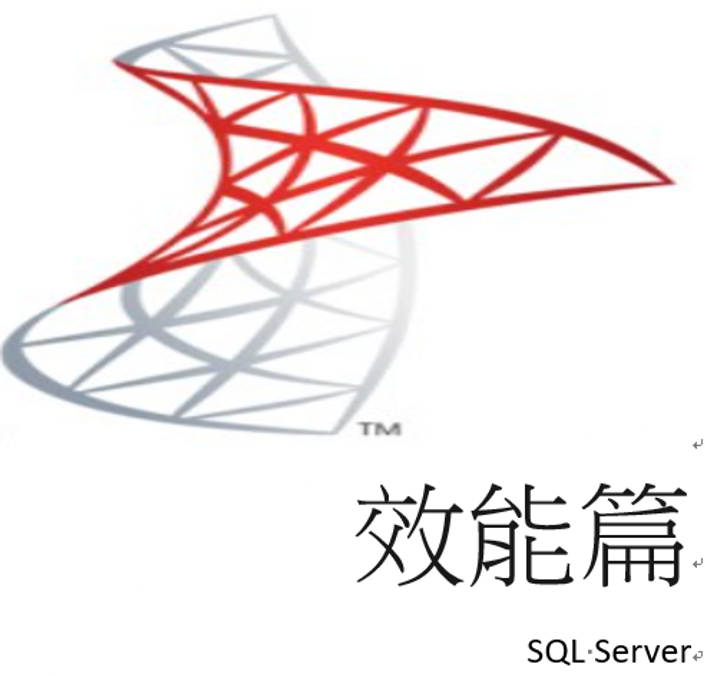](https://ricochen-s-school.teachable.com/p/sql-server-ebook4) | [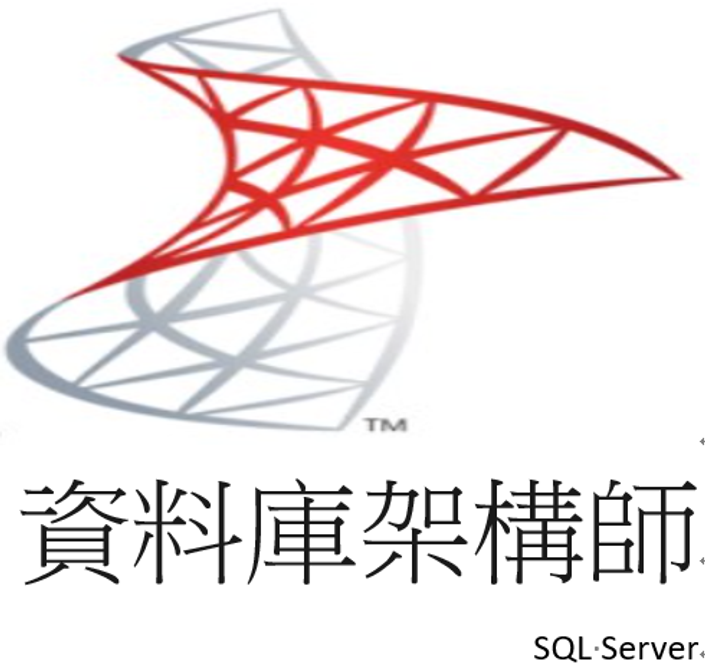](https://ricochen-s-school.teachable.com/p/sql-server-ebook5) | [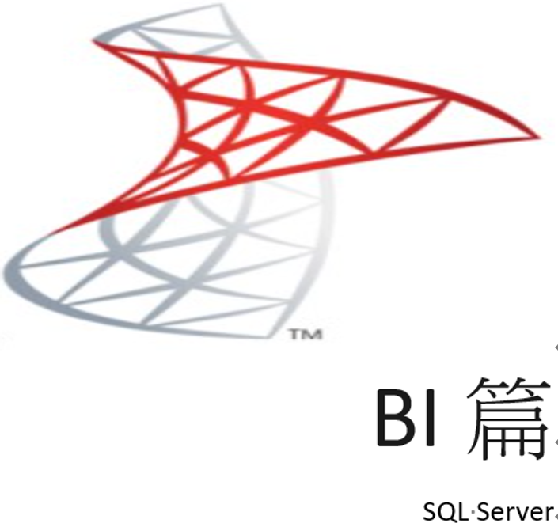](https://ricochen-s-school.teachable.com/p/sql-server-ebook6)
